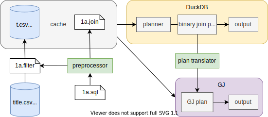
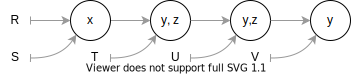

# Comparing and Unifying WCOJ with Binary Join
The goal of this project is to compare [generic join](https://gitlab.com/remywang/blog/-/blob/master/posts/wcoj.md) with traditional binary join. We conjecture that the performance of any *linear* binary join plan can be matched by a plan using only generic joins (with a few optimizations). 

We will focus on queries in the [join order benchmark](https://github.com/gregrahn/join-order-benchmark), and compare against an in-memory DB like [DuckDB](https://duckdb.org) or [SQLite](https://www.sqlite.org/index.html). We can consider Postgres if we can figure out how to benchmark against it fairly. 

## First experiments
Before jumping into implementation, we should test out our idea with some experiments. For example, we can manually translate a few queries into GJ and compare the performance. Concretely: 
1. Run some queries from the JOB benchmark and see how many only use linear join.  
2. Pick a couple queries (linear ones first) and manually translate to GJ. For this, consider using the implementation [here](https://github.com/mwillsey/egg-smol/blob/a1acf4dc7b6f65f2dd4bbca38d45d40448eda4d8/src/gj.rs#L159) and [here](https://github.com/mwillsey/qry/blob/11c92ff715d0593c0ca86c2b533b9ef8a249bd2c/src/lib.rs#L302). 
3. Pre-filter the input tables. 
4. See if GJ runs faster than the DuckDB baseline. 

## System architecture


Because we focus on joins, we need to isolate the time spent in filtering. We break each query into two parts, one contains only the joins and the other only the filters. See [normalize](normalize.md) for an example. We use the filters to create intermediate tables (cached), and run the joins on these intermeditates. 

We first run the joins on the tables in DuckDB and measure run time. DuckDB will produce a join plan for the query which we translate into a plan for GJ. It's important that the binary plan is linear; we may need to instruct DuckDB to only consider linear plans. Using the translated plan, we run GJ and get the run time. 

## Plan Translator
We start with a simple algorithm to translate binary join plans to generic join plans. We focus on linear plans first. 

Consider the query `Q(*) :- R(x, y), S(x, z), T(y, z), U(y, z), V(y).` with the following query plan: 



The plan first joins R with S on x, then joins the result with T on y and z, so on and so forth. We convert this to a variable ordering for GJ simply by traversing the plan: 
1. The first variable is x, taken from the first join of R, S on x. 
2. The second variable can be either y or z; suppose we pick y, which will lead GJ to intersect R, T, **U and V**. 
3. The third variable is z, intersecting S, T and U. 
The GJ algorithm looks like the following: 
```
for a in inter(R.x, S.x)
	for b in inter(R[a].y, T.y, U.y, V.y)
		for c in inter(S[a].z, T[b].z, U[b].z)
			output(a, b, c)
```
Note that even though we had 4 joins in the linear binary plan, GJ only needs 3 intersections, because each intersection can process multiple relations. 

**Merging variables**. We may improve the simple variable ordering by merging the variables x and y. That is, the GJ algorithm looks like this: 
```
for a in inter(R.x, S.x)
	for (b,c) in inter(R[a].y, S[a].z, T.yz, U.yz, V.y)
		output(a, b, c)
```
The intersection in the second loop can be done by iterating over `(y,z)` in T while looking up `y` and `z` from the other relations. Compared to the classic GJ which has 3 loops, this version may have better locality. 

**Delayed intersection**. There is another optimization we can do on the original GJ plan. Suppose V is very large and the lookup on V.y always succeeds. Then we can save some time by delaying the lookup on V until the inner loop: 
```
for a in inter(R.x, S.x)
	for b in inter(R[a].y, T.y, U.y)
		for c in inter(S[a].z, T[b].z, U[b].z)
			if b in V.y
				output(a, b, c)
```

In summary, the full plan for free join is a sequence of nodes, where each node contains some variables and some relations. During GJ, the loop nest follows the sequence. Each node correspond to a loop level, where we intersect relations in the node on variables in that node. 

**Bushy plans**. To support bushy plans, the GJ plan will also be bushy. In addition, we need to materialize some intermediate join results. 

## Join algorithms
We will implement different algorithms for generic join based on which data structure we use to store the relations: 
1. Hash trie
2. Sorted trie
3. Flat sorted array
4. Segmented array

**Hash trie.** Hash trie is easy to implement, and has good support for column-wise layout. Indexing will also be fast since a lookup is constant time. However it is not very cache friendly due to pervasive random access and pointer chasing. Iterating over a hash table can also be slow when the table is sparse, since it takes time proportional to the *capacity* of a hash table to iterate over it. 

**Sorted trie.** Sorted trie will likely be more cache-friendly. It will still chase pointers, but that overhead may be neglegible. Adapting a column-wise layout may be challenging for sorted tries - DuckDB would [convert to row-wise before sorting](https://duckdb.org/2021/08/27/external-sorting.html). Indexing may also carry some overhead since lookup (binary search / gallop) is $O(\log(N))$. 

**Flat sorted array.** Storing all tuples in a flat sorted array may further improve locality and eliminate pointer-chasing. Intersection may be slower, because we now have duplicate values for each column. 

**Segmented array.** This is the same way TACO stores sparse tensors (in CSF). It's pretty much the same as the sorted trie, except that the tuples themselves are stored in a single array, and instead of pointers, each trie node stores offsets to that array. This combines some benefits of the previous two storage formats. 

## Column store
DuckDB's speed is largely due to the columnar design: a table is stored as a collection of columns instead of rows. We want to replicate the same columnar layout for GJ. This would require different approaches for hashing and sorting. 

**Hashing.** If we use a hash trie, we can simply store a table as columns. When a query arrives, we figure out which columns are used, and load them into hash tries. 

**Sorting.** If we use a sorted trie, we need to sort the table before constructing the trie. Sorting the columns is tricky and will likely offset any speedup from the columnar storage. In fact, DuckDB [converts to a row-wise layout](https://duckdb.org/2021/08/27/external-sorting.html) before sorting any table. We might as well store the table by row in the first place. When querying, we may still choose to only load attributes used by the query. 

## Indexing
Generic join incurs a linear-ish (linear for hash tries and $O(n \log (n))$ for sorted tries) overhead to load the input relations into tries. This is fine in most cases, since both merge-sort join and hash join need to scan the entire input relations. However, an index join may touch only a tiny fraction of the indexed relation, so we cannot afford to sort the entire relation for generic join. 

The solution is to also create indices for generic join. An index is simply a partially sorted trie. For example, an index for `R(x,y,z,w)` on `x` is a 2-level trie, where the first level stores `x` in sorted order, and each `x` points to an unsorted set of tuples `(y,z,w)`. During generic join execution, we may directly intersect with the pre-sorted `x` level. For each `x` value in the intersection, we can now sort `(y,z,w)` so that we can intersect with them further down the loop. This lazy sorting saves us time from sorting tuples in regions not returned from the index join on `x`. 

## Tensor algebra and generic join
Since relational algebra is equivalent to tensor algebra, the tensor algebra compiler [TACO](http://tensor-compiler.org) implements an algorithm for sparse tensor algebra that precisely coincides with generic join. We may therefore piggyback on TACO to answer queries. 

The main components to implement are: 

1. Translate a binary join plan to a generic join plan (variable order). 
2. Translate the query and plan to tensor algebra. This requires: 
	1. Translating [SQL to CQ](sql2cq.md) 
	2. Rewriting the CQ accoding to the variable order
	3. Translating the CQ to tensor algebra 
3. Translate tables to tensors 

But before jumping into implementation, we should test out our idea with some experiments. For example, we can manually translate a few queries into tensor algebra and compare the performance. Concretely: 
1. Run some queries from the JOB benchmark and see how many only use linear join.  
2. Pick a couple queries (linear ones first) manually translate to tensor algebra. 
3. Translate the input tables of these queries to tensors. 
4. See if the tensor algebra expression runs faster than the DB baseline. 
5. If it goes well, try out some bushy plans too. 

If we're lucky, we'll see speedup / matching performance in the experiments! But it is *still* not time to start implementing. Just like software development, high-quality research should be done in a **test-driven** way. This means we should first work out how to *evaluate* our prototype, *before* implementing the prototype! And for good science we want the evaluation to be **reproduceable**. The steps to set up evaluation is: 
1. Create a docker environment in which we will run all experiments. This involves downloading the benchmark queries and data, installing baseline DBs like DuckDB and SQLite. Carefully document so that anyone can follow it. 
2. Set up scripts to benchmark queries automatically. Ideally, running `./run-experiment.sh` should produce the **exact figures** we will use in our paper. 
3. Of course we can't get the plots for our prototype yet since it does not exist. Put in some arbitrary line for now. 

Several points in this process requires extra care: 
- The optimizer may occasionally choose a bushy plan, in which case we should consider how to [combine](combine-gj.md) multiple GJ plans. 